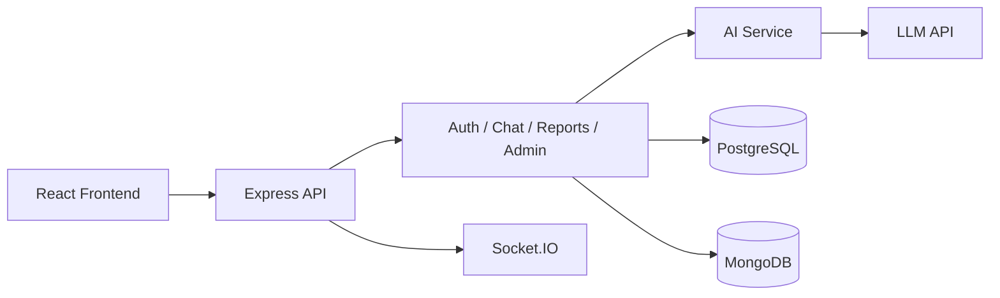

# AI-Driven Public Health Chatbot for Disease Awareness

A full-stack healthcare project built with a practical implementation focus. The goal is to help users ask symptom-related questions, understand possible risk, review their own health activity, and find hospitals without pretending to be a diagnostic system.

## Production-Ready Features

- Full-stack architecture (`React.js` + `Node.js` + `Express.js`)
- AI-powered chatbot with verified fallback safety
- Dual database design (`PostgreSQL` + `MongoDB`)
- Real-time assessment updates with `Socket.IO`
- CI/CD pipeline using `GitHub Actions`
- Dockerized local deployment with `Docker Compose`
- Swagger API documentation at `/api/docs`
- Lazy loading and route-based performance optimization

## Tech Stack

- Frontend: React.js (Vite)
- Backend: Node.js + Express.js
- Databases:
  - PostgreSQL for users, hospitals, disease info
  - MongoDB for chat history and AI response logs
- Auth: JWT + bcrypt
- Security: Helmet, CORS, validation, sanitization, rate limiting, request IDs

## Architecture Diagram

See [docs/architecture.md](docs/architecture.md) for the Mermaid architecture and sequence diagrams.



## Folder Structure

```text
ai-public-health-chatbot/
  .github/
    workflows/
      ci.yml
  docs/
    architecture.md
  backend/
    src/
      config/
        db.js
        socket.js
        swagger.js
      controllers/
        auth.controller.js
        chat.controller.js
        disease.controller.js
        history.controller.js
        hospital.controller.js
        notification.controller.js
        profile.controller.js
        report.controller.js
        symptom.controller.js
        tip.controller.js
      middlewares/
        adminMiddleware.js
        authMiddleware.js
        errorHandler.js
        requestContext.js
        validate.js
      models/
        Chat.js
        SymptomCheck.js
      routes/
        auth.routes.js
        chat.routes.js
        disease.routes.js
        history.routes.js
        hospital.routes.js
        notification.routes.js
        profile.routes.js
        report.routes.js
        symptom.routes.js
        tip.routes.js
      services/
        ai.service.js
      utils/
        audit.js
        logger.js
        sanitize.js
        seedData.js
      app.js
    tests/
      auth.test.js
      chat.test.js
    Dockerfile
    package.json
    server.js
  frontend/
    src/
      components/
        GlobalToast.jsx
        Navbar.jsx
        ProtectedRoute.jsx
      context/
        AuthContext.jsx
        LanguageContext.jsx
      hooks/
        useAuth.js
        useLanguage.js
      pages/
        AdminPage.jsx
        ChatbotPage.jsx
        DashboardPage.jsx
        HealthHistoryPage.jsx
        HealthReportsPage.jsx
        HealthTipsPage.jsx
        HospitalsPage.jsx
        LandingPage.jsx
        LoginPage.jsx
        NotFoundPage.jsx
        ProfilePage.jsx
        RegisterPage.jsx
        SymptomCheckerPage.jsx
      services/
        api.js
        health.service.js
        socket.js
      App.jsx
      main.jsx
      styles.css
    Dockerfile
    package.json
    vite.config.js
  docker-compose.yml
  README.md
```

## Core Features

- User register/login
- JWT protected routes
- Chat interface for health questions
- Guided symptom checker with follow-up questions and risk score
- AI-generated structured response
- Risk level classification (Low / Medium / High)
- Hospital search by city with specialist recommendation
- Health history timeline per user
- AI-generated health report with printable PDF export
- Health report charts for symptom frequency, activity, and risk trend
- Weekly health trend analytics based on recent user assessments
- Daily health tips page
- User profile page with age, gender, city, and medical notes
- Notifications panel with follow-up and awareness alerts
- Chat history pagination (`page`, `limit`)
- Hindi / English language toggle for the main user journey
- Real-time assessment sync using Socket.IO
- Admin panel:
  - Add, edit, and delete hospitals
  - Add, edit, and delete verified disease info
- Add, edit, and delete health tips
- Input validation and centralized error handling
- AI fallback handling using verified disease data
- Request ID tracking in logs and error responses
- Health check endpoint for ops readiness
- Swagger documentation at `/api/docs`
- Audit logging for admin CRUD actions and chat history clearing
- Confidence score and prompt version metadata in chat responses
- Jest + Supertest API tests for key auth and chat flows
- GitHub Actions CI pipeline for automated test and build validation

## Main Pages

- Dashboard
- AI Chatbot
- Symptom Checker
- Hospitals
- Health History
- Health Reports
- Health Tips
- User Profile
- Admin Panel

## Health Endpoint

- `GET /api/health`

Example response:

```json
{
  "status": "OK",
  "uptime": "12345s",
  "database": "connected"
}
```

## System Flow

1. User logs in and gets JWT token.
2. User asks health question from chatbot page.
3. Backend validates and sanitizes input.
4. AI service returns structured response with confidence score and prompt version.
5. Response is stored in MongoDB and sent to frontend.
6. A Socket.IO event is emitted so the UI can refresh live.
7. If AI fails or returns unsafe structure, backend uses disease-name matching from PostgreSQL and returns fallback advisory.

## API Response Format

Success format:

```json
{
  "success": true,
  "message": "Chat generated successfully",
  "data": {}
}
```

Error format:

```json
{
  "success": false,
  "message": "Validation error",
  "error": "Email is required",
  "requestId": "abcd-1234"
}
```

## Important Endpoints

- `POST /api/auth/register`
- `POST /api/auth/login` (rate-limited)
- `POST /api/chat` (protected + rate-limited)
- `GET /api/chat/history?page=1&limit=10` (protected)
- `POST /api/symptoms` (protected)
- `GET /api/history` (protected)
- `GET /api/reports` (protected)
- `GET /api/docs`
- `GET /api/profile` (protected)
- `PUT /api/profile` (protected)
- `GET /api/notifications` (protected)
- `GET /api/hospitals?city=<city>`
- `POST /api/hospitals` (admin only)
- `PUT /api/hospitals/:id` (admin only)
- `DELETE /api/hospitals/:id` (admin only)
- `GET /api/diseases`
- `POST /api/diseases` (admin only)
- `PUT /api/diseases/:id` (admin only)
- `DELETE /api/diseases/:id` (admin only)
- `GET /api/tips`
- `POST /api/tips` (admin only)
- `PUT /api/tips/:id` (admin only)
- `DELETE /api/tips/:id` (admin only)
- `GET /api/health`

## Database Schema Explanation

### PostgreSQL (structured relational data)

- `users`: identity, credentials, role
- `hospitals`: fixed attributes and search by city
- `diseases`: verified disease awareness content used for fallback

### MongoDB (flexible chat records)

- `chats`: each user query + structured AI output + risk level + confidence score + prompt version + timestamps
- `symptom_checks`: guided symptom checker submissions, risk score, and timestamps

### Why PostgreSQL + MongoDB?

- PostgreSQL gives strong constraints for auth/admin data.
- MongoDB fits dynamic chat payloads and history growth.
- This split keeps data modeling practical and easy to explain.

## AI Prompt and Fallback Logic

- AI integration is API-based (no custom model training).
- Prompt asks for strict JSON output with fixed keys.
- Prompt version is stored as metadata so response behavior is easier to explain and evolve.
- Response parser validates structure, normalizes risk level, and rejects clearly unsafe or messy output.
- Confidence score is estimated from symptom knowledge matches and disease table matches.
- If AI fails:
  - query is matched against `diseases.disease_name` using case-insensitive containment logic
  - if matched, return verified disease details
  - else, return a safe general advisory

## Risk Classification Logic

Risk classification is based on rule-based symptom severity mapping combined with AI context interpretation.

- High: emergency-like terms (example: chest pain, breathing difficulty)
- Medium: moderate concern terms (example: fever, persistent pain)
- Low: general awareness level

## Security Implemented

- Password hashing with bcrypt
- JWT authentication middleware
- Role-based middleware for admin routes
- Role checks are logged with request IDs
- Audit trail stored in `audit_logs` for admin CRUD operations
- Input validation using Joi
- Input sanitization using sanitize-html
- Rate limiting for chat endpoint
- Additional rate limiting on login endpoint
- Centralized error handling with request ID
- Structured logging

## Healthcare Safety Notes

- This project is for awareness and triage support only. It is not a medical diagnosis system.
- Every AI response includes a disclaimer.
- Logs avoid storing raw passwords and focus on operational metadata like request IDs, route usage, and admin actions.
- Encryption at rest is not implemented in local development. For deployment, database volume encryption or managed database encryption should be enabled.
- Sensitive personal data should be kept minimal, and production deployment should add stronger access controls and secrets management.

## Operational Readiness

- Startup fails fast if PostgreSQL or MongoDB connection fails
- Graceful shutdown on `SIGINT` / `SIGTERM`
- DB connections are closed before exit
- Health check available for Docker/CI monitoring
- API docs available through Swagger UI
- Dockerfiles provided for frontend and backend
- `docker-compose.yml` provided for local full-stack startup
- GitHub Actions CI pipeline runs backend tests and frontend build checks on push and pull request

## Real-Time Updates

- Socket.IO is used to emit `assessment:created` events after a chat assessment is saved.
- The chat page listens for these events and refreshes the history automatically.

## Testing

Current automated test coverage includes:

- `backend/tests/auth.test.js`
- `backend/tests/chat.test.js`

These tests cover:

- successful registration
- invalid login handling
- protected chat creation
- clearing chat history

## CI/CD

- GitHub Actions workflow file: `.github/workflows/ci.yml`
- Runs on `push` to `main` and on `pull_request`
- Starts PostgreSQL and MongoDB service containers in CI
- Installs backend and frontend dependencies
- Runs backend Jest tests
- Builds the frontend with Vite

## Trade-offs

- LLM API is used instead of self-trained NLP model to keep project scope practical and implementation-focused.
- Rule-based risk mapping is simple and explainable but not a clinical diagnostic model.
- Dual database setup adds slight complexity but improves data-model fit.
- Hindi support is implemented for the main user journey and structured health responses, but not every page has full translation coverage yet.
- Real-time updates improve user feedback, but the app still uses standard request-response for the actual chat submission.

## Local Setup

### 1) Backend setup

```bash
cd backend
npm install
copy .env.example .env
npm run seed
npm run dev
```

If local PostgreSQL is already using port `5432`, run the Docker PostgreSQL container on `5433` and keep `POSTGRES_URI` aligned with `backend/.env.example`.

Run backend tests:

```bash
npm test
```

### 2) Frontend setup

```bash
cd frontend
npm install
copy .env.example .env
npm run dev
```

## Docker Setup

Run the full stack with Docker:

```bash
docker compose up --build
```

Services:

- Frontend: `http://localhost:5173`
- Backend: `http://localhost:5000`
- Swagger docs: `http://localhost:5000/api/docs`
- PostgreSQL: `localhost:5433`
- MongoDB: `localhost:27017`

## Environment Variables

### Backend (`backend/.env`)

- `PORT`
- `NODE_ENV`
- `JWT_SECRET`
- `JWT_EXPIRES_IN`
- `POSTGRES_URI`
- `MONGO_URI`
- `AI_PROVIDER`
- `AI_API_KEY`
- `AI_MODEL`
- `FRONTEND_URL`

### Frontend (`frontend/.env`)

- `VITE_API_BASE_URL`

## Default Notes for Demo

- Seed script inserts 30 hospitals, 15 diseases, and 20 health tips.
- Seed script is idempotent and avoids duplicates.
- Register a user normally.
- Admin role can be assigned directly in PostgreSQL `users` table (`role = 'admin'`) for demo.

## Disclaimer

Every AI response includes:

"This information is for awareness only and not a substitute for professional medical advice."

## Future Scope

- Geolocation-based nearest hospital suggestions
- Better risk scoring using medical protocol data
- Wider automated test coverage
- Optional doctor escalation workflow for high-risk cases
