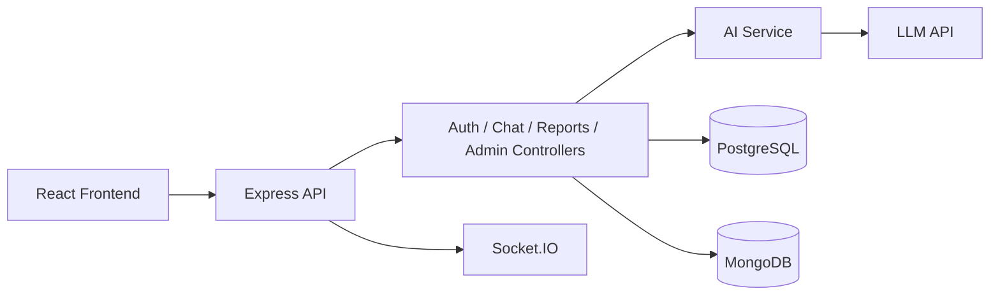
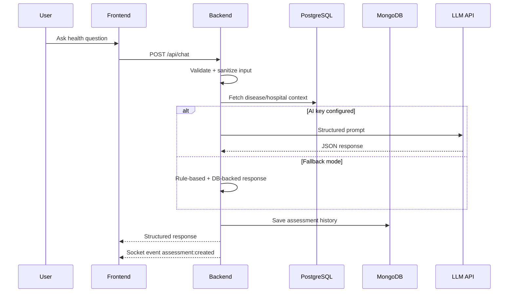

# System Diagrams

## Architecture Diagram

```mermaid
flowchart LR
  A[React Frontend] --> B[Express API]
  B --> C[Auth / Chat / Reports / Admin Controllers]
  C --> D[AI Service]
  C --> E[(PostgreSQL)]
  C --> F[(MongoDB)]
  B --> G[Socket.IO]
  D --> H[LLM API]
```

## Chat Assessment Sequence

```mermaid
sequenceDiagram
  participant U as User
  participant F as Frontend
  participant B as Backend
  participant P as PostgreSQL
  participant M as MongoDB
  participant L as LLM API

  U->>F: Ask health question
  F->>B: POST /api/chat
  B->>B: Validate + sanitize input
  B->>P: Fetch disease/hospital context
  alt AI key configured
    B->>L: Structured prompt
    L-->>B: JSON response
  else Fallback mode
    B->>B: Rule-based + DB-backed response
  end
  B->>M: Save assessment history
  B-->>F: Structured response
  B-->>F: Socket event assessment:created
```
