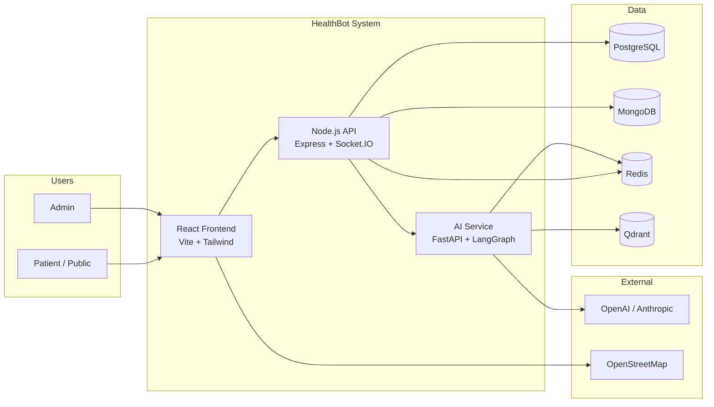
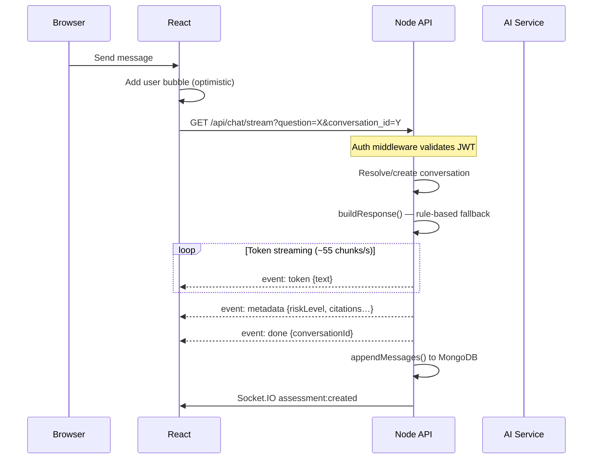
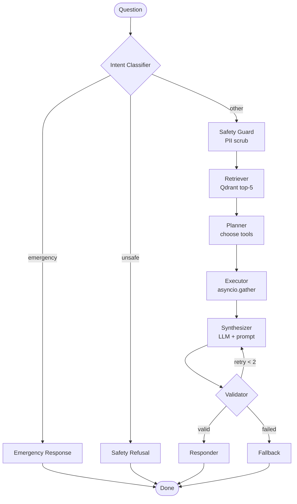
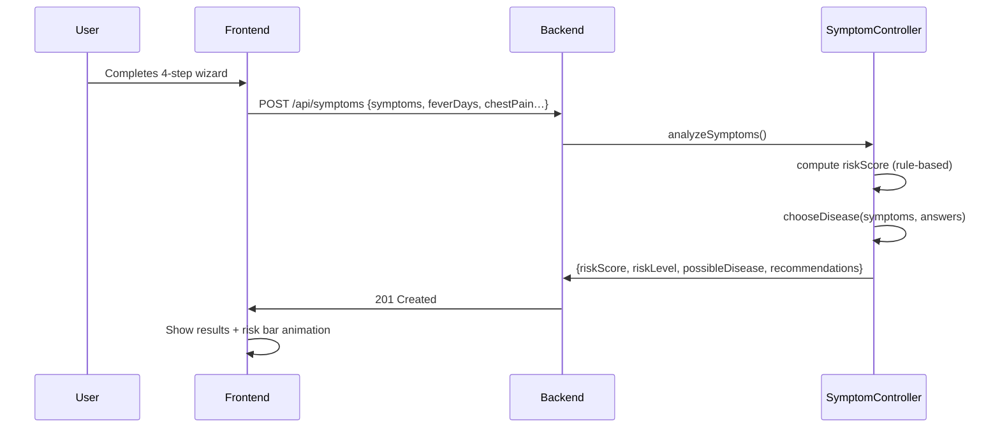

# Architecture — AI-Driven Public Health Chatbot

## System Context (C4 Level 1)

## Container Diagram (C4 Level 2)

| Container | Tech | Port | Responsibility |
|---|---|---|---|
| Frontend | React 18 + Vite + Tailwind | 5173 | SPA — all UI pages |
| Backend API | Node.js 20 + Express | 5004 | Auth, chat, CRUD, SSE streaming |
| AI Service | Python 3.11 + FastAPI | 8000 | LangGraph agent, RAG, embeddings |
| PostgreSQL | v16 | 5433 | Users, sessions, hospitals, diseases, audit |
| MongoDB | v7 | 27017 | Conversations, messages, symptom checks |
| Redis | v7 | 6379 | Session memory, tool cache, BullMQ queues |
| Qdrant | v1.9 | 6333 | Medical knowledge vectors (384-dim MiniLM) |

## Chat Streaming Sequence

## LangGraph Agent Flow

## Data Flow — Symptom Check

