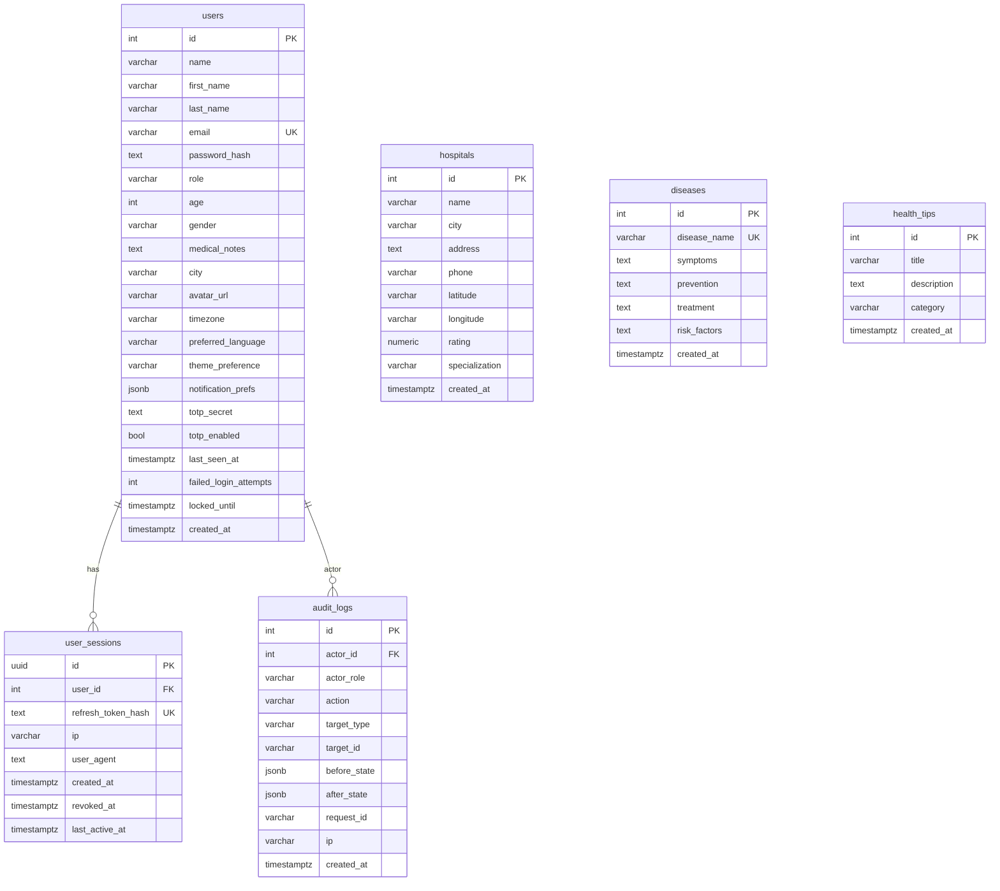

# Data Model — HealthBot

## PostgreSQL Schema (ERD)



## MongoDB Collections

### `conversations`
```json
{
  "_id":             "ObjectId",
  "userId":          123,
  "title":           "I have fever and headache",
  "language":        "en",
  "is_deleted":      false,
  "message_count":   4,
  "total_tokens":    1240,
  "summary":         "",
  "last_message_at": "2026-04-29T10:00:00Z",
  "created_at":      "2026-04-29T09:55:00Z"
}
```

### `messages`
```json
{
  "_id":              "ObjectId",
  "conversationId":   "ObjectId",
  "role":             "user | assistant | system",
  "content":          "Plain text content",
  "structured_output": {
    "symptoms_detected": ["fever"],
    "risk_level":        "Medium",
    "confidence":        0.78,
    "citations":         []
  },
  "prompt_version":   "health-awareness-v2",
  "latency_ms":       342,
  "created_at":       "2026-04-29T10:00:05Z"
}
```

### `symptomchecks`
```json
{
  "_id":     "ObjectId",
  "userId":  123,
  "symptoms": ["Fever", "Headache"],
  "followUpAnswers": {
    "feverDays":           2,
    "breathingDifficulty": false,
    "chestPain":           false,
    "fatigueLevel":        "Low"
  },
  "riskScore":      4,
  "riskLevel":      "Medium",
  "possibleDisease":"Viral infection",
  "emergency":      false,
  "recommendations":["Rest", "Stay hydrated"],
  "created_at":     "2026-04-29T10:10:00Z"
}
```

### `feedbacks`
```json
{
  "_id":            "ObjectId",
  "userId":         123,
  "messageId":      "string",
  "conversationId": "string",
  "rating":         1,
  "reason":         "Helpful",
  "comment":        "Good answer",
  "created_at":     "2026-04-29T10:15:00Z"
}
```

## Design Rationale

| Decision | Reasoning |
|---|---|
| PostgreSQL for users + hospitals | Strong constraints (UNIQUE email, FK integrity), ACID guarantees for auth/billing-adjacent data |
| MongoDB for conversations | Schema-free — `structured_output` varies per AI model version; horizontal scale for high-volume chat |
| Redis for sessions + cache | Sub-millisecond reads; TTL-based expiry natural fit for tokens and tool cache |
| Qdrant for embeddings | Best-in-class filtered vector search; native Docker; no cloud dependency |
| Soft-delete on conversations | Preserves audit trail; user can "undo" delete within a grace window |
| Argon2id for passwords | OWASP recommended; memory-hard, resistant to GPU brute-force |
| UUID for session IDs | Unpredictable; safe to store in client localStorage as opaque token |
